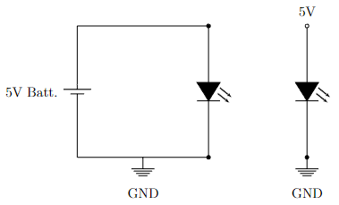
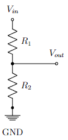

# Lab 1: Arduino 101

## Contents

- [Lab 1: Arduino 101](#lab-1-arduino-101)
  - [Contents](#contents)
  - [Materials](#materials)
  - [Introduction](#introduction)
  - [Procedure](#procedure)
    - [1. The Breadboard](#1-the-breadboard)
    - [2. LED Blink](#2-led-blink)
    - [3. Voltage Divider](#3-voltage-divider)
  - [Post-Lab Questions](#post-lab-questions)
  - [Submission](#submission)
  - [Post-Lab Extra Assignment](#post-lab-extra-assignment)

## Materials

For this lab, you will need:

- [ ] 1 Arduino Nano Every
- [ ] 1 Breadboard
- [ ] 1 Programming Cable (and adapters if necessary)
- [ ] 6 LEDs
- [ ] 2 1k$$\Omega$$ resistors
- [ ] A hand-full of jumper wires (it is possible to do the whole lab without any)
- [ ] A computer with the Arduino IDE [installed](/tutorials#arduino-ide-install) and [setup](/tutorials#arduino-library).

## Introduction

You will be given feedback (and later graded) on your use of color coding when wiring breadboard circuits. Please take careful note of the guidelines listed below!

- **Red:** Power (5v, 3.3v, etc.)
- **Black:** Ground
- **Blue:** Analog (Pins labeled with an A, and most likely used for analogRead or sensor data)
- **Yellow:** Digital (Pins labeled with a D, most likely used to control things or for more complicated sensors)

**Use of vertical breadboard rails:** Utilize the breadboard rails (blue and red) to run power and ground lines for easy access across the entire breadboard. For example, run a black jumper cabled from the Arduino ground pin to one of the blue rails, and then connect another black jumper from the grounded blue rail to the other blue rail. Now both blue rails are grounded, and can be used as the ground terminal for any components. Similarly, you could connect a red jumper from the 5v pin on the Arduino to one of the red rails, and use that rail for a 5v supply. In future labs, when we're working with 5v and 3.3v, we will have you run a rail for each voltage.

Welcome to ENGR100-980! Over the course of the next semester, you will be designing and building your own circuit board, complete with measurement instruments to gather information on acceleration and pressure (altitude!) data. To get to that point, we will spend the first several labs learning about various components and eventually how to combine them into a cohesive system.

In lecture, you've had a crash course on the ins and outs of micro-controllers. Now, you'll be working with your own **Arduino Nano Every** micro-controller so you can begin to learn how to use it. The Nano Every will be the brain of your payload; it is very well-suited to these sorts of applications, as you will see.

The **IO pins** on the Nano Every each serve different purposes. Above, and in [resources](/resources#arduino-nano-every-pinout), is a helpful diagram detailing the types of pins on the board.

*[IO]: Input/Output

In general, the digital pins are on one side (D2 - D13), and the analog pins are on the other (A0 - A7). Digital pins only read and write binary values - HIGH (5V) or LOW (0V). Analog pins can also write these binary values. However, analog pins can read more than just binary values. They read a range of analog values from 0V - 5V. An analog pin reads the voltage that it "sees" on the circuit or sensor you connect it to.

Finally, it's worth noting the GND pin. Voltage values are read with respect to some constant reference. They are relative, not absolute. This reference is usually called 'Ground.' There should ALWAYS be a ground connection on every circuit you make, whether you are using a micro-controller or not. This is essential when dealing with electricity, to make sure that things don't spark or get fried because they draw too much power.

To illustrate, consider the simple LED circuit shown below, where a 5V supply powers a bulb, which is attached to GND. The two circuits shown are actually equivalent representations of the same thing. In the circuit on the left, the 5-volt battery raises the top half of the loop 5 volts higher than the bottom half. The bottom half of the loop is held at zero volts, since it is grounded. Current flows clockwise from the positive (top) to the negative (bottom) terminals of the battery.

In the circuit on the right, the top node is held at 5V by some unseen source, and the bottom is held at 0V because it is grounded. The current flows down, into the grounded node. This representation works great if you want to analyze a fragment from a larger circuit.

{: .invert-colors-in-dark-mode }

## Procedure

### 1. The Breadboard

Before actually launching into the building of circuits, it's important to understand the tools that you are working with. Your breadboard will act as the "circuit board" on which you build your systems. Notice that it is organized by enumerated rows and columns.

The pins of the electronic devices go into the holes in the breadboard. These holes are related to each other in that every row of 5, as defined on the board, are electrically connected. This means that if, for instance, you connect a 5V battery to a given hole, all of the holes in that row are raised to 5V. The Arduino Nano Every will supply 5V, so if you supply a given hole with 5V, all of the holes in that row will have 5V.

[Here is a helpful video on breadboards](https://www.youtube.com/watch?v=fq6U5Y14oM4)

Circuit elements are connected in breadboards by connecting the input pins of one device to the same row as the output pins of another device. In this way, devices can be chained together to create complex circuits. An example is shown below. This circuit is called a voltage divider, and consists of two resistors connected end to end. A formal circuit diagram of a voltage divider is shown later in this manual, and in [resources](\resources#voltage-divider).

Your lab instructors will demonstrate using a breadboard before the lab begins. If you have questions about whether or not you are connecting devices appropriately, please don't hesitate to ask.

The image below shows the inner workings of a breadboard. Hopefully this demystifies the connections inside of the plastic housing for you.

1. [Check out the first half of this video.](https://www.youtube.com/watch?v=QM6EY0VEqBA)  This shows how to connect an LED to the 5V output pin of the Arduino, a resistor, and then to ground.  This circuit will work without any Arduino code at all and is a good test for the circuit board and powering the Arduino!  This is the circuit you will build in step 2.

2. Build the LED circuit shown in the schematic below. When built, it should look similar to the voltage divider circuit in Fig. 3, except one of the resistors will now be an LED. Be aware that LEDs only turn on when placed in your circuit in the correct orientation. Try switching the orientation of your LED if it doesn't turn on after completing step 2.
    

    **Hint:** one leg is longer than the other! Check the [references](/resources.md) page for more...
    

    {: .invert-colors-in-dark-mode }
    Note: Vin refers to the 5V pin on the Arduino for now.  We will move this in **2.3** below.

3. Turn on the Arduino by plugging in the mini USB cord into the device and the USB into the computer. Note that an LED built into the micro-controller should begin glowing. The LED you connected to the Arduino should also begin to glow if your circuit is correct.

4. To run any code on the Arduino, you will need to set your environment. Open up the Arduino IDE on your computer. We will need to add a library to access the starter code for our class. To setup your Arduino IDE and required library, follow the instructions in [tutorials](/tutorials).

   *[IDE]: Integrated Development Environment

5. Make sure the correct board is connected under the "Tools" menu. The board should be "Arduino Nano Every". You might have to change the selected port if the IDE is failing to find the board.

Do not continue to the next section unless you can see your Arduino Nano Every and its port in your Arduino IDE, and there are LED(s) on its board that are lit up.

### 2. LED Blink

1. [Check out this video that walks you through how to do this part.](https://www.youtube.com/watch?v=vD98tOiiRws)
2. Let's run our first code. Navigate to File → Examples → ENGR100-980 → Lab1-LED. A new window should open up, with some code on it. (Make sure to set the proper micro-controller and processor under the Tools menu). Upload and run the code, and observe what happens.
3. Now, let's try making an external LED blink instead of the built-in one. To do this, connect your LED and resistor circuit's positive side to one of the digital pins on the Arduino. Make sure you modify the code such that `#define LED_PIN_0 ?` replaces "?" with the pin number you are plugged into. For example, D7 would replace "?" with "7".
4. Once this works, we are going to connect 5 more LEDs all to different pins. Your goal here is to take your new knowledge about breadboards to connect all 6 of your LEDs to your breadboard while using only 1 resistor. (Each LED still needs to be connected through a resistor though!) Now edit the code, using the existing lines as context, to make all 6 LEDs (not the built-in LED) flash in a wave pattern (Knightrider).
5. Upload this code and again observe that the same behavior happens, but this time on the external LED as well. Now, take a picture of your breadboard in its working state. This will be included in your submission later.

REMEMBER TO TAKE A PICTURE, YOU WILL BE SUBMITTING IT!

6. When someone around you is ready to help you with this step, unplug your Arduinos and breadboards from your computers and swap them with a neighbor. Each of you should move one wire on each other's circuit without the other person watching. Hand each others boards back and attempt to diagnose what the other person changed in your board. Take a picture of this new board state to include in your submission. Once you believe you have fixed the issue, consult your original photo to ensure everything is wired as it was. Now, plug the Arduino and breadboard back into your computer and verify the LED still flashes as expected.

**Note:** If you are having trouble finding a partner, you do not need to swap with someone, simply having someone else change your board without you watching will suffice.

AGAIN, DON'T FORGET THE PICTURE FOR YOUR SUBMISSION.

### 3. Voltage Divider

Consider a voltage divider shown below. The output voltage is related to the input voltage through the equation

$$ V_{out} = \frac{R_2}{R_1 + R_2} V_{in} $$

**Note:** The order of the resistors here matters a great deal, getting them confused will lead you to the wrong value.

{: .invert-colors-in-dark-mode }

The concept of the voltage divider can be extended to any number of resistors. The output voltage at each node is simply the total resistance below that node divided by the total resistance of the circuit. As you might have guessed from the formula, when resistances are placed in-series like so, their resistances add. Make sure you understand the concept, you'll need it for future labs.

1. Disassemble any circuits you have from the previous parts of the lab.

2. Plug a wire directly from the 5V line of the Arduino to the A1 pin of the Arduino.

3. Go to File → Examples → ENGR100-980 → "Lab1-Voltage-Divider" to open the starter code for this section.
  - Here we will use the `analogRead()` function to read in the voltage.
  - To send the data back from the Arduino to your computer our sample codes uses `Serial`. First it specifies `Serial.begin(9600)` to initiate communications between the Arduino and your computer. The "9600" specifies the baud rate, and lets the Arduino know how fast to send data to the computer. Then, to actually transmit data, we use `Serial.print(dataHere)`. The variable `dataHere` can be data of many types, including integers, doubles, and character arrays.
4. To see the data sent from the Arduino to the computer, open the Serial monitor inside of the Arduino IDE. This can be done by clicking the magnifying glass in the top, right-hand corner of the IDE.
  - At the bottom of the Serial monitor, make sure the baud rate is set at 9600 to match the Arduino.
  - Record the value returned by `analogRead()`, as you’ll need it later.
5. Build a voltage divider by setting $$V_{in}$$ as the 5V line of the Arduino, have $$R_1$$ be 1k$$\Omega$$ and $$R_2$$ be 1k$$\Omega$$.
  - Plug $$V_{out}$$ into A1 of the Arduino.
  - Resistance is denoted by a band color code, which you should get used to reading. Check the chart in [resources](/resources#resistor-color-codes) for info and data on how to read resistances of resistors using their colors.
  - Our code uses the `analogRead()` function to read in the voltage and record the raw number that the function returns.
1. Try playing with various resistor values, and take down the values from two more combinations of resistors. Make sure to write down the resistor combinations as well as the analog output for both of your additional experiments.
2. Come up with a combination of resistors that will result in an output voltage of less than 1.25V.
  - You can convert the raw output from `analogRead()` into voltage values by multiplying by 5/1023.
  - You will learn why in lab 3! Try it and see if it works.

## Post-Lab Questions

1. Write a short explanation of what your peer changed on your breadboard and why you think this would cause it to not work as normal (or, why you think their change would not have impacted anything).
2. What combination of resistors did you use to get to less than 1.25V at the analog pin in step 3.7? Draw them in a circuit and upload/attach a picture of this circuit to make it clear where you put the resistors.
3. Using three resistors in series, draw a voltage divider circuit with two $$V_{out}$$s (one between resistors 1 and 2 and one between resistors 2 and 3). $$V_{out1}$$ should be equal to $$\frac{2}{3} V_{in}$$ and $$V_{out2}$$ should be equal to $$\frac{1}{3} V_{in}$$. Give possible values those resistors could take. What would happen if we doubled the value of all of the resistors?

Hint: Resistors in series add together.  So, if you have three resistors that are each 100$$\Omega$$, and measured the voltage between the first and second resistors, the voltage divider circuit would have 100$$\Omega$$ on one side and 200$$\Omega$$ on the other side.

## Submission

On Canvas, you will submit ***ONE PDF*** that will include all of the following:

- [ ] A picture of your breadboard with an external LED on it being lit up while plugged into an Arduino. (You'll receive full points for submitting this. We will simply be using it to give feedback on color coding in preparation for stricter grading in later labs.)
- [ ] A photo of your breadboard (unplugged from your computer) in its broken state.
- [ ] Written post-lab answers for questions 1-3.
- [ ] 2 circuit diagrams (i.e., schematics) in total for post-lab questions 2 and 3.

To put said content into a PDF, it is suggested you create a new Google Doc and paste your images and write your text in the document. Export/Download this document as a PDF and upload it. **DO NOT SUBMIT A GOOGLE DOC FILE.**

Submitting anything other than a single PDF may result in your work not being graded or your scores being heavily delayed.

