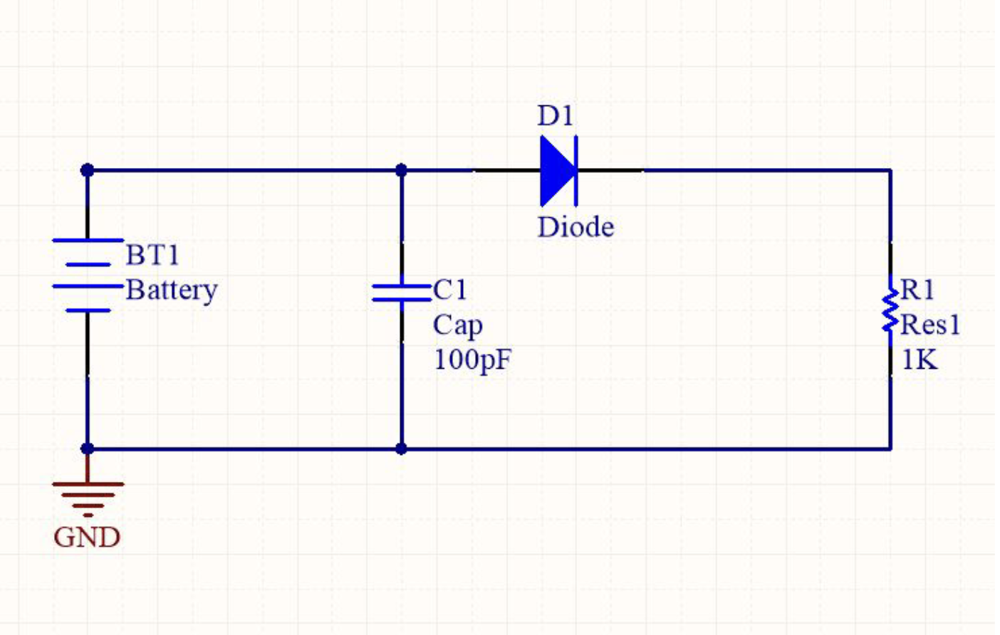

# Lab 1b: Creating an Altium Schematic

Note: While it is okay to work next to someone else to accomplish this goal and to help each other with it, each person needs to work through this and provide their own screenshot.  Please do not work as a team and turn in the same screenshot.

- You can and should watch this HandsOnEngineering video on Altium: [Link to video](https://www.youtube.com/watch?v=9W7zGEHqjcg)

## Contents

- [Lab 1b: Creating an Altium Schematic](#lab-1b-creating-an-altium-schematic)
    - [Contents](#contents)
    - [Resources](#resources)
    - [Getting Started](#getting-started)
    - [Procedure](#procedure)
        - [Starting the Project](#starting-the-project)
        - [Adding relevant documents](#adding-relevant-documents)
        - [Using key shortcuts](#using-key-shortcuts)
        - [Some common shortcuts](#some-common-shortcuts)
        - [Circuit we are building](#circuit-we-are-building)
        - [Back to building](#back-to-building)
        - [Connecting components](#connecting-components)
        - [Some schematic pointers](#some-schematic-pointers)
        - [Finishing up schematic design](#finishing-up-schematic-design)
        - [Saving and compiling schematic](#saving-and-compiling-schematic)
    - [Submission](#submission)

## Resources

For this lab, you will need:

- [ ] A CAEN computer, or a computer running UofM VMWare to access Altium software.
- [ ] [Altium libraries .zip file](https://drive.google.com/file/d/1JMCNjsRCwUEqwYapCFaCCkwo2zHAycD3/view?usp=drive_link) (you will need to unzip before using)
- [ ] [Spreadsheet of Footprints](https://drive.google.com/file/d/1tsC8cM-wiYfIB25BBM7o7ymhQ4F3gtD8/view?usp=sharing)
- [ ] [Second Spreadsheet of Footprints](https://drive.google.com/file/d/1LVTbnMMa6W0KI2mwZwTfUbNu1QJWeqjq/view?usp=sharing)

## Getting Started

- Upon logging in, a window should appear with a software directory.

- Search for Altium

- Launch the app from the software directory, and then again from the Cloudpaging player.

- Wait 20 minutes for Altium to open...

## Procedure

#### Starting the project

- If you have a “Storage Manager” window that opens, feel free to close it.

1. File -> New -> Project
1. Project Types: PCB
1. Project Templates: Default
1. Name: Whatever you want to call it
1. Click “OK”
1. Project should appear in the “Project” taskbar on the left

#### Adding relevant documents

- Right click on your project in the left taskbar

1. Add New to Project -> Schematic
1. Add New to Project -> PCB
1. Download the libraries that are provided in the [resources](#resources) section, and drag them onto the
the left taskbar, ensure they are a part of your project
    - You may have to drag them to the taskbar and they will be under “Free Documents”.
    - Drag again to ensure they are a part of your project and save your project immediately after.
    - Right click on project title in left taskbar -> Save Project.

#### Using key shortcuts

- The letter underlined on the different options on the top taskbar can be used
as key shortcuts to save you some time

1. For example, on Altium schematic let’s say you want to do the following :
Place -> Part
1. Instead of hovering your mouse over to “Place” and then to “Part”, you could
instead just press “p” and “p” on your keyboard and you will end up with the
same result
1. Will save you a lot of time when placing components, wires and traces

#### Some common shortcuts

- Schematic
    - p+p - Place a part
    - p+w - Place a wire
- PCB
    - p+t - place a trace
    - p+g - place a polygon pour
    - t+g+a - refill a polygon pour (after adding traces that cut through the polygon pour)

#### Circuit we are building

#### Back to building

- Go to your schematic document

1. Place components by going to Place -> Part
1. Click on “Choose”
1. You will have 3 schematic libraries you will have parts from
    - Miscellaneous Devices
    - Miscellaneous Connectors
    - ENGR100Sch
1. Find the component, click “OK” and “OK” again
1. Place the component on the schematic, and press “Esc” + “Esc” if you do not
need more copies of that component
1. You can press the spacebar while placing the component to rotate it

#### Connecting components

- Once components have been placed, there are a couple of ways to “connect”
them.

1. Wire:
    - Place -> Wire
    - Allows you to drag a “wire” that connects two components on the schematic
    - Your net/wire will have a cross mark at your pointer, if that cross mark becomes large and red you know you are at another pin
    - If you connect across a wire a dot will appear that confirms electrical connection
1. Net:
    - Place -> Net Label
    - Allows you to place a net that can be labelled a certain thing (5V, ARD_D1, HUM_OUT, etc.)
    - If two pins are connected to the same net label then they will be electrically connected
    - Will reduce the number of wires and make it easier to understand what components are connected in your schematic visually

#### Some schematic pointers

1. GND has a separate net: Place -> Power Port
    - Depending on your preferences, this may not be the case
    - If above holds true, can either edit preferences or have another net that is labelled GND
1. Schematic layout is only concerned with electrical connections, not mechanical footprints
    - That is for the PCB
1. Make sure you label your components (Your resistors should not be “R?” but
“R1”, “R2”, etc.) or you will get errors when compiling

#### Finishing up schematic design

1. Double click on each component
1. Under “Models”, click on “Edit”
1. Under “PCB Library”, select “Any” if not already selected
1. Under “Footprint Model”, select “Browse”
1. You will have libraries for:
    - Miscellaneous Devices
    - Miscellaneous Connectors
    - ENGR100Pcb
1. Select the correct footprint corresponding the spreadsheets provided (Canvas > Lab Files > Altium Resources) to ensure we have the correctly sized component for you when soldering
1. Click “OK” (x3)

#### Saving and compiling schematic

1. Right click on your project -> Add New to Project -> Output Job File
1. Under Validation Outputs -> Right click on Add New Validation Output -> Electrical Rules Check -> Your schematic document
1. On the left taskbar, right click your Output Job File to save
1. Right click on the .SchDoc document under your project on the left Taskbar and click “Save”
1. Right click on the .SchDoc document under your project on the left Taskbar and click “Compile document”
1. On the bottom right, find and click the button System -> Messages
    - If you find any errors or warnings, correct them
    - If not, you should not have electrical issues
1. This does not mean your connections are correct with your circuit, so please quadruple check your connections

## Schematic to PCB

Later on, in lab 6 prelab, you will turn this schematic into a PCB! The instructions to do so can be found [here](/labs/lab-6-prelab).

## Submission

On Canvas, you will submit ***ONE PDF*** that will include all of the following:

- [ ] A screenshot of the schematic you made, which should look much like the example provided earlier.

Export/Download this document as a PDF and upload it. **DO NOT SUBMIT A GOOGLE DOC FILE**.

Submitting anything other than a single PDF may result in your work not being graded or your scores being heavily delayed.

