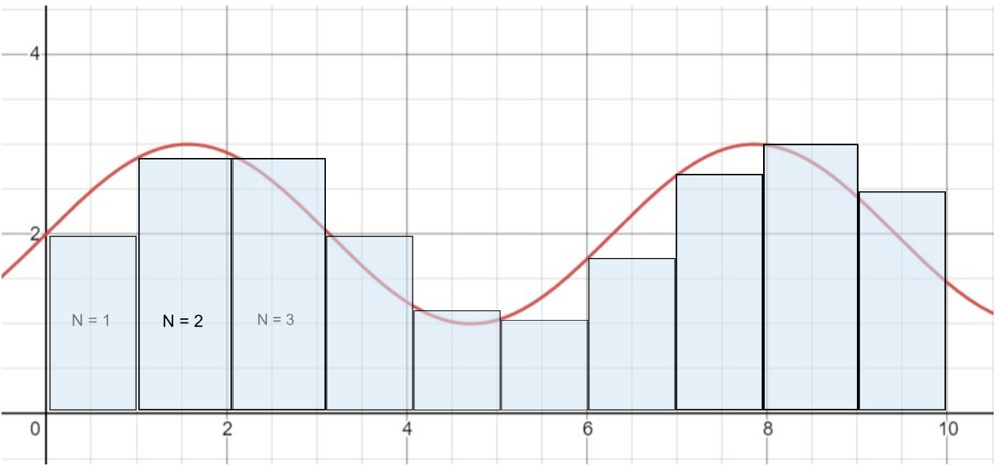
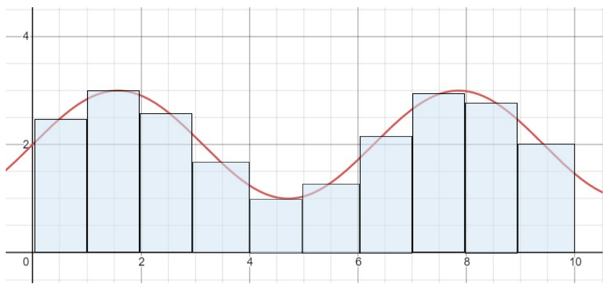

# Lab 2: Iterative Numerical Analysis in a Computer

## Materials

For this lab, you will need

- [ ] 1 Computer with your spreadsheet software of choice

## Introduction

One of the goals of this class is to teach you how computers can be used to solve a system of equations that represents a physical system, such as a rocket being launched into space, or an orbiting object. In this lab, we will start the process of learning how to do this. Ultimately, we want to solve the kinematic equations for an object, but we will start off a bit easier in this lab.

**Note:** Kinematics: the brach of physics that studies the motion of points and bodies. In other words, how things move around in space.

One of the assumptions of basic kinematic equations is that acceleration is constant. With complicated systems like objects in orbit, that is often not true. In this case, you cannot use the algebraic kinematic equations to solve for the motion–you need an often complicated system of differential equations that require calculus. In that case, you need a computer to help you solve the system.

We are not in a position for that yet, so we will simplify things to get started! Let's look at some of the simple kinematic equations and explore solving a system of equations. The basic variables in kinematic equations are:

### Kinematic Equations

- **Time (t):** the time of the system (units: s). Often, we have variables that are labeled with a zero (0), which means “initial”, or the value at the start. So, **t0** is the initial time, while "**t**" is the current time. The difference in time between the start and current time can be thought of as delta time, or **&Delta;t**.
- **Position (x)**: where the object is (units: m). The initial position is **x0**, while the change in position is **&Delta;t**.
- **Velocity (v)**: how fast the object is moving, or the change in position over time (units: m/s). The initial velocity is **vo**, while the change in velocity is **&Delta;v**.
- **Acceleration (a)**: the change in velocity over time (units: m/s2) Here we are going to assume that acceleration is constant.

These variables can be related through these kinematic equations:
1. $$ \Delta t = t - t_0 $$
2. $$ x = x_0 + \frac{v_0 + v}{2}dt $$
3. $$ v = v_0 + a\cdot dt $$
4. $$ x = x_0 + v_0 \cdot dt + \frac{a \cdot dt^2}{2} $$

## Procedure

### Using Equations in Spreadsheets

You can use spreadsheets as a simple way to solve equations with given inputs. You let the spreadsheet know that you’re writing an equation by starting with “=”. You can then input numbers, multiplication (*), division (/), addition (+), and subtraction (-). You can also do exponents (x^y). Some functions are also built into the spreadsheet like a calculator, such as pi (written as PI() ) and trigonometric functions (but be careful, these are set to radians).

Another thing you can do is use inputs from other cells in the spreadsheet. For example, if you wanted to find the area of a circle (A = pi * r^2) based on an input radius, you could do the following:

<iframe src="https://docs.google.com/spreadsheets/d/e/2PACX-1vRhSGIhjrbpW8pHbsjqsHXEsfuim8gFMDlTg311B0SDyENsLTJZ64YZ3BJLik6-5XvSH1uNJKytiCJ2/pubhtml?gid=0&amp;single=true&amp;widget=true&amp;headers=false"></iframe>

You could then put a radius value in cell A2 and cell B2 would give you the resulting numerical area.

If you need more help, watch the first 10 minutes of this video:

<iframe width="560" height="315" src="https://www.youtube.com/embed/kqYpuxFNNcs?si=li32aautne0fmw9N" title="YouTube video player" frameborder="0" allow="accelerometer; autoplay; clipboard-write; encrypted-media; gyroscope; picture-in-picture; web-share" allowfullscreen></iframe>

### Numerical Integration (Area Under Curve)

In calculus, we use a system called integration to find the exact area under a curve. This can be helpful in a situation where we have a plot of velocity over time: the area under that curve is the total distance traveled. To demonstrate this, think of a person moving at a constant speed of 10 feet per minute for five minutes, then stopping. The curve would look like this:

<iframe width="600" height="371" seamless frameborder="0" scrolling="no" src="https://docs.google.com/spreadsheets/d/e/2PACX-1vRUfVh7HELEdXgGlRsBa6FV8_MVIGBj11MmYsl6Afj4rzVDsfNd-WRXFjVGlgWK20sKiqG0yGnytFZv/pubchart?oid=1337267870&amp;format=interactive"></iframe>

We can view this as a rectangle with a height of 10 (ft/min) and a width of 5 (min). To find the area, we multiply the width by the height:

$$\frac{10m}{s}\cdot 5s = 50m$$

However, when we have curves with less defined shapes, it can be harder to find the area using this method. We can instead use an approximation using bars to “fill” the area under the curve. We will be using two such approximation methods for two types of curves.

### Left-Side Riemann Sums:

For this method, we create bars of a width dx using the height of the curve on the left hand side of this box. For example, here we approximate the area under this curve $$y = sin(x) + 2$$ in the domain $$[0, 10]$$ with a $$dx$$ of 1.

You then can find the area of each box based on the width and height. When you add all the areas together, you have an approximation of the area under the curve.

To find how many boxes B you’re creating, divide the range of the domain by dx. For each box, use the following equations based on n, which box it is, starting at 1:

$$X_N = (N - 1) \cdot dx$$       (This is so we get the left-hand side of the box.)
$$f \cdot X_N = y_N$$            (In other words, find the y-value of the function at XN.)
$$ A_N = dx \cdot yN$$.          (The area of the box is AN.)
$$A = \sum_{N=1}^B A_N$$         Where A is the approximate area under the curve and B is the total 
number of boxes created.

Let’s play with this a bit for real.
<a href="https://docs.google.com/spreadsheets/d/1xl7DczPknd83Nsr2LQn84r-fFm-Jviuj7_fKSWT7bS4/edit#gid=0" target="_blank">There is a viewable spreadsheet here you can make a copy of</a>:

<iframe src="https://docs.google.com/spreadsheets/d/e/2PACX-1vQe7ig7Hy0ZXIOurjdu-nj-3fsAgQJhs9wC_-qtnadnWLVPsBRAcP46Pu0sXaqbQoVN3HGiqpE15Xao/pubhtml?gid=0&amp;single=true&amp;widget=true&amp;headers=false"></iframe>

Let’s walk through this spreadsheet a bit:
- At the top, we define 3 variables:
  - dx = 1.0 (You can play with this.)
  - Start x = 0.0 (You can play with this and see what happens…)
  - End x = 10.0 (You can play with this.)
- We then have 6 columns where we are doing our calculation:
  - A (x0 - left): defines the left edge of our area of the small box
  - B (x1 - right): defines the right edge of our area of the small box
  - C (y = sin(x) + 2): this is the function that we want to evaluate.  We are calculating the area under this function.
  - D (area in single cell): This is the area in the single small box from x0 to x1.
  - E (area in while domain): This is the sum of all of the small areas.
  - F: There are indicators of the start cell and end cell for the calculation. We will get more sophisticated in this as the semester progresses, but for now, this really just indicates when column B (x1) is 10.0.
- There should be 2 plots (charts, in google speak):
  - A plot of “y = sin(x) + 2” (column C) from row 8 to row 17 (C8:C17)
  - A plot of “area in whole domain” (column E) from E8:E17

Just so we are all on the same page, according to this calculation, the total area under the curve at this point should be 21.96 (in cell E17).

Make a copy of this page (File - Make a copy) and place it somewhere in your own google drive directory.  You could download this as an excel spreadsheet if you would like also and do all of this on your computer with Excel.

Using your personal copy, let’s change some things and see what happens:
  - Change $$dx$$ to 0.5, 0.25, 0.125, and 0.1. Compare the areas of the domains using different $$dx$$.
  - Change dx back to 0.5. Change “end x” to 20.0. Compare the areas of the function using different "end x".

Let’s play with the plots!  
- If you click on the top chart, you will see the three vertically aligned dots.  Click on those, and then on “Edit Chart”.  That will bring up a sidebar that lets you edit things about the chart. 
- In the “Data Range” box, you should see “C8:C17,A8:A17”.  The first group is the y-axis values, while the second is the x-axis values.  If you are still set up for the “dx = 0.5” and “end x = 20.0” configuration from above, then change the data range to be “C8:C47,A8:A47”, which should now plot between 0-19.5. Change the second chart (area in whole domain) to the same data range. 

Let’s see how the error in the area changes as a function of “dx”.  You have entered some numbers above. Let’s try to make a plot from these values.  You can do this by:
1. Make a new spreadsheet tab (lower left "+" button)
2. Make the columns "dx", "total area (x = 0-10)", "total area (at dx = 0.1)", "difference"
3. Fill in the values for dx = 1.0, 0.5, 0.25, 0.125, 0.1 given your values recorded above.
4. Find the differences
5. Make a plot of difference (as the y-axis) vs dx (as the x-axis).

## The Lab Itself
Ok, now that we have run through this with our example, we would like you to try to build some spreadsheets on your own. For each of these things, we would like you to do the following:
- Create the spreadsheet with the proper columns (x0, x1, y, area in single cell, area in whole domain); as well as plots of y and the area. (HINT: Just duplicate the "Sin" tab and change the formula!)
- Play with the dx and see how dx alters the error, including a plot.

We’re going to apply this information to three types of common curves: a linear curve, a quadratic curve and a logarithmic curve. You will use Excel (or google sheets) to make your calculations easier. For both types of curves, we will give you the domain and the exact area under the curve so you can calculate the exact error. We will give you an example spreadsheet for the linear curve, but you will create your own for the quadratic and logarithmic curves. Try changing the dx value to make your error smaller, and plot your absolute errors as a function of dx. You will see that as your dx becomes smaller, your error also becomes smaller. As dx becomes infinitely small, your error should approach zero!

### Linear Curve:

$$y = x$$

Domain: $$x =  [0, 20]$$

Exact area under the curve: 200 square units

### Polynomial:

$$y = x^3 - 15x^2 + 71x - 105$$

Domain: $$x = [0, 9]$$

Exact area under the curve: -74.25 square units

### Logarithmic Curve:

$$Y = ln(x)$$  (where ln is the natural logarithm)

Note: the excel function for this is LN(#), where # is your chosen value.

Domain: $$x = [1, 10]$$

Exact area under the curve: 10ln(10) - 9 square units (use this expression for greater resolution in error calculations)

### Deliverables:
- 4 spreadsheets (one has been given to you) with graphs of errors in area estimation against the step size dx. Your spreadsheets should have correct formulas but do not need to display data for each step size used--that should be recorded in a separate table to be made into a graph.

## Bonus Material

### Midpoint Riemann Sums:
Similar to the Left-Side Riemann Sums, you can create boxes of width dx and a height that follows the curve, but instead use the value halfway through your step. Here is an approximation of the same curve as before in the domain [0, 10] with a dx of 1.

Same as with the left-side boxes, you find the area of each individual box then sum them up for an approximation for the area under the curve.

To find how many boxes B you’re creating, divide the range of the domain by dx. For each box, use the following equations based on n, which box it is, starting at 1:

$$X_N = (N - \frac{1}{2}) \cdot dx$$       (This is so we get the left-hand side of the box.)
$$f \cdot X_N = y_N$$            (In other words, find the y-value of the function at XN.)
$$ A_N = dx \cdot yN$$.          (The area of the box is AN.)
$$A = \sum_{N=1}^B A_N$$         Where A is the approximate area under the curve and B is the total 

What does this mean practically?

In our $$y = sin(x) + 2$$ spreadsheet, we can do the following things to make the area more accurate:
- Select column C, so the whole column is highlighted (click on “C”)
- Insert a column to the left of Column C (insert->Column left)
- In Cell C8, write a formula “=(A8+B8)/2”
- Google will ask if you want to autofill the rest of the column. Yes you do!
= In cell D8, it should have “=sin(A8) + 2”.  Change this to “=sin(C8) + 2”
- Copy cell D8 to the rest of the cells in column D.
Now your spreadsheet is set up to use the cell center values instead of the left side values!  You can then see if this is more accurate by looking at the behaviour as a function of dx.

