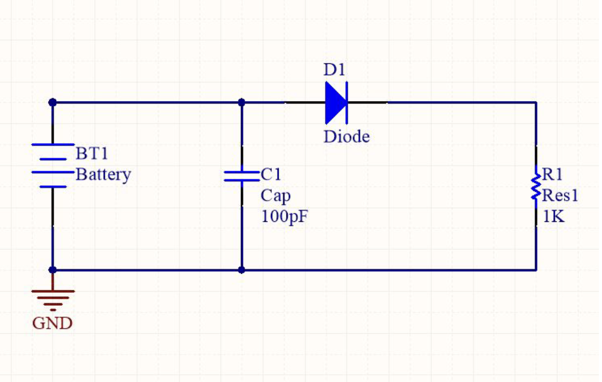

# Lab 2b: Creating a KiCad Schematic

You should work on this assignment in pairs, but you must **SUBMIT YOUR OWN INDIVIDUAL WORK**. Aside from hardware photos, all submitted content must be your original work and not copied from anyone else. Submissions that are not your own may result **IN POINT DEDUCTION OR A ZERO.**

## Contents

- [Lab 1b: Creating a KiCad Schematic](#lab-1b-creating-a-kicad-schematic)
    - [Contents](#contents)
    - [Resources](#resources)
    - [Getting Started](#getting-started)
    - [Procedure](#procedure)
        - [Starting the Project](#starting-the-project)
        - [Using key shortcuts](#using-key-shortcuts)
        - [Some common shortcuts](#some-common-shortcuts)
        - [Circuit we are building](#circuit-we-are-building)
        - [Back to building](#back-to-building)
        - [Connecting components](#connecting-components)
        - [Some schematic pointers](#some-schematic-pointers)
        - [Saving and compiling schematic](#saving-and-compiling-schematic)
    - [Submission](#submission)

## Resources

For this lab, you will need:

- [ ] A computer running [UofM Omnissa Horizon Client](https://950.engr100.org/tutorials#installing-omnissa-horizon-client) to access KiCAD software.
- [ ] KiCAD properly [installed](https://950.engr100.org/tutorials#kicad-install).
- [ ] You can, and should watch this HandsOnEngineering video on KiCAD: [Link to video](https://www.youtube.com/watch?v=N5ABkj99-lc)

<!--
[ ] List of footprints

(commented out, they won't need this until later, and we need to make sure that these libaries actually work)- [ ] [Altium libraries .zip file](https://drive.google.com/file/d/1JMCNjsRCwUEqwYapCFaCCkwo2zHAycD3/view?usp=drive_link) (you will need to unzip before using)
[//]: # [Spreadsheet of Footprints](https://drive.google.com/file/d/1tsC8cM-wiYfIB25BBM7o7ymhQ4F3gtD8/view?usp=sharing)
[//]: # [Second Spreadsheet of Footprints](https://drive.google.com/file/d/1LVTbnMMa6W0KI2mwZwTfUbNu1QJWeqjq/view?usp=sharing)
-->

## Getting Started

- Launch KiCAD

## Procedure

#### Starting the project

1. File -> New Project
2. Save project as whatever you desire, selecte create a new folder for project
3. Your project should now appear on the left
4. Click on Schematic Editor to open up a new schematic

#### Using key shortcuts

- The letter underlined on the different options on the top taskbar can be used
as key shortcuts to save you some time

1. For example, on KiCAD schematic let’s say you want to do the following :
Place -> symbol
1. Instead of hovering your mouse over to “Place” and then to “symbol”, you could
instead just press "a" on your keyboard and you will end up with the
same result
1. Will save you a lot of time when placing components, wires and traces

#### Some common shortcuts

- Schematic
    - a - Place a symbol
    - w - Place a wire
- PCB
    - a - place a footprint
    - x - place a single track

#### Circuit we are building

#### Back to building

- Go to your schematic document

1. Place components by going to Place -> symbol
1. Default KiCAD libaries will now load
1. Search for the component you need, click the component, and press ok
1. Place the component on the schematic, and press “Esc” + “Esc” if you do not
need more copies of that component
1. You can press the "R" while placing the component to rotate it

#### Connecting components

- Once components have been placed, there are a couple of ways to “connect”
them.

1. Wire:
    - Place -> Wire
    - Allows you to drag a “wire” that connects two components on the schematic
    - If you connect across a wire a dot will appear that confirms electrical connection
1. Net:
    - Place -> Net Labels
    - Allows you to place a net that can be labelled a certain thing (5V, ARD_D1, HUM_OUT, etc.)
    - If two pins are connected to the same net label then they will be electrically connected
    - Will reduce the number of wires and make it easier to understand what components are connected in your schematic visually

#### Some schematic pointers

1. GND has a separate net: Place -> Power Symbols -> GND
    - Depending on your preferences, this may not be the case
    - If above holds true, can either edit preferences or have another net that is labelled GND
1. Schematic layout is only concerned with electrical connections, not mechanical footprints
    - That is for the PCB
1. Make sure you label your components (Your resistors should not be “R?” but
“R1”, “R2”, etc.) or you will get errors when compiling

<!--#### Finishing up schematic design

1. Double click on each component
1. Click on the empty box under the column "Value" and the Row "Footprint", a libary symbol should pop up next to the empty box
1. Click that libary symbol to bring up the list of footprints
1. Select the correct footprint corresponding the spreadsheet/pdf provided earlier
1. Click “OK”
-->
#### Saving and compiling schematic

1. Make sure you are saving your project
2. Go to file -> plot
3. Select PDF as the output format, and click on Plot All Pages
4. Make sure the output messages box say done and plotted to a location
5. Double check that the PDF is now in your files

## Schematic to PCB

Later on, in lab 6 prelab, you will turn this schematic into a PCB! The instructions to do so can be found [here](/labs/lab-6-prelab).

## Submission

Reminder: You should work on this assignment in pairs, but you must **SUBMIT YOUR OWN INDIVIDUAL WORK**. Aside from hardware photos, all submitted content must be your original work and not copied from anyone else. Submissions that are not your own may result **IN POINT DEDUCTION OR A ZERO.**

On Canvas, you will submit ***ONE PDF*** that will include all of the following:

- [ ] A pdf of the schematic you made, which should look much like the example provided earlier.

**DO NOT SUBMIT A GOOGLE DOC FILE**.

Submitting anything other than a single PDF may result in your work not being graded or your scores being heavily delayed.

