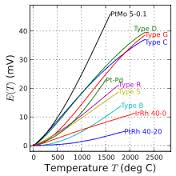

# Lab 3: Temperature Sensing

<div class="primer-spec-callout danger" markdown="1">
You should work on this assignment in pairs, but you must **SUBMIT YOUR OWN INDIVIDUAL WORK**. Aside from hardware photos, all submitted content must be your original work and not copied from anyone else. Submissions that are not your own may result **IN POINT DEDUCTION OR A ZERO.**
</div>

## Contents

- [Lab 3: Temperature Sensing](#lab-3-temperature-sensing)
  - [Contents](#contents)
  - [Materials](#materials)
  - [Introduction](#introduction)
    - [How Analog to Digital Converters (ADCs) Work](#how-analog-to-digital-converters-adcs-work)
    - [BME680 4-in-1 Digital Sensor](#bme680-4-in-1-digital-sensor)
  - [Procedure](#procedure)
    - [1. Wiring the BME680](#1-wiring-the-bme680)
    - [2. Testing the BME680](#2-testing-the-bme680)
    - [3. Wiring the TMP36](#3-wiring-the-tmp36)
    - [4. Uploading the Code](#4-uploading-the-code)
    - [5. Collecting Data](#5-collecting-data)
    - [6. Making a Calibration Curve](#6-making-a-calibration-curve)
    - [7. Modifying the Code](#7-modifying-the-code)
    - [8. Freezer Test](#8-freezer-test)
  - [Post-Lab Questions](#post-lab-questions)
  - [Schematic](#schematic)
  - [Submission](#submission)

## Materials

- [ ] 1 Arduino Nano Every
- [ ] 1 Breadboard
- [ ] 1 Programming Cable (and adapters if necessary)
- [ ] 1 TMP36 Temperature Sensor
- [ ] 1 BME680 Digital Sensor
- [ ] A handful of jumper wires
- [ ] A computer with the Arduino IDE [installed](/tutorials#arduino-ide-install) and [setup](/tutorials#arduino-library).
- [ ] KiCAD [installed](/tutorials#kicad-install)
- [ ] ENGR100 KiCAD Library [Library](https://drive.google.com/drive/folders/1Q-wHqaKj7w7wq1GUlMQrJVHRTt22oBnl?usp=sharing)
- [ ] The following list of symbols to use in your schematic:


## Introduction

<div class="primer-spec-callout danger" markdown="1">
**Starting in this lab, you will be graded** on your use of color coding when wiring breadboard circuits. Please take careful note of the guidelines listed below!

- **Red:** Power (5v, 3.3v, etc.)
- **Black:** Ground
- **Blue:** Analog (Pins labeled with an A, and most likely used for analogRead or sensor data)
- **Yellow:** Digital (Pins labeled with a D, most likely used to control things or for more complicated sensors)

**Use of vertical breadboard rails:** Utilize the breadboard rails (blue and red) to run power and ground lines for easy access across the entire breadboard. For example, run a black jumper cable from the Arduino ground pin to one of the blue rails, and then connect another black jumper from the grounded blue rail to the other blue rail. Now both blue rails are grounded and can be used as the ground terminal for any components. Similarly, you could connect a red jumper from the 5v pin on the Arduino to one of the red rails and use that rail for a 5v supply. In future labs, when we're working with 5v and 3.3v, we will have you run a rail for each voltage.
</div>

[This video goes through how to set up the TMP36 and is very useful to watch before you get started.](https://www.youtube.com/watch?v=Mdx2m6hNuqc)

This lab represents the start of your journey into developing your rocket's sensor board. Your board will measure an ensemble of variables, including temperature, pressure (to derive altitude), and acceleration. We will begin with the simplest, most visceral metric: temperature. This lab introduces two sensors associated with your rocket's sensor board: the **digital** BME680 and an **analog** TMP36 temperature sensor that you will calibrate.

A **sensor** is a device that provides measurement of some environmental observable. Many times, sensors work by **transduction** whereby they convert one form of energy into another, often times converting input to electrical energy. However, how do we know what the relationship is between the input and the output? If, for instance, the output from a temperature sensor reads as 2 Volts at room temperature, what does an output of 3 Volts mean? In order to answer this question, we need to generate a **calibration curve** for the sensor: an equation that maps input values against output values.

Here's a cool example: since you'll be dealing with a temperature sensor this lab, check out these calibration curves for different flavors of a temperature sensor that relies on a physical process called the thermoelectric effect. When two dissimilar metals are brought into contact, a voltage is generated between them that is proportional to temperature. Hence: Thermo-Electric. This sensor is called a thermocouple. In the figure below, we can see multiple calibration curves for different types of thermocouples.

{: .invert-colors-in-dark-mode }

Over the next few weeks, you will become very familiar with the sensors used in this course. We'll start by looking at the BME680 and the TMP36. Unlike the thermocouple, the TMP36 has built-in processing circuitry that makes its calibration curve nearly linear. More on the BME680 below.

### How Analog to Digital Converters (ADCs) Work

In lab 1, you may have figured out the form of the relationship between the raw voltage and value returned by `analogRead()`. However, it's unlikely you got this relationship exactly right, as that requires a slightly deeper understanding of how they work at the physical level. We wanted you to simply begin to think about how it worked before. Now, we'll cover this subject more deeply than both the prior labs and videos did.

To begin, we have to consider the differences between the real world and the digital world. The digital world is essentially discrete, whereas the real world is essentially continuous (we are going to ignore quantum mechanics). This means that when converting from the real world to the digital world, there will be some loss of information. This is an important fact to consider when evaluating a sensor or other tool.

The ADC we're using in class is no exception - the maximum resolution, or how finely the instrument can be read, is controlled by the number of bits in the ADC. The more bits an ADC has, the higher the resolution. The equation below lets you calculate an approximate resolution. $$V_{ref}$$ is the maximum voltage of the ADC and bits is the number of bits in the ADC.

$$ Resolution = \frac{V_{ref}}{(2^{bits}-1)} $$

Now, to turn the raw value returned by `analogRead()` into a voltage, you need to simply multiply it by the resolution of the ADC. This is shown by the formula below.

$$ Voltage = Value \cdot Resolution $$

This is not exactly correct, but we will cover this in class later.

### BME680 4-in-1 Digital Sensor

The BME680 is a digital sensor that measures temperature, humidity, pressure, and volatile organic compound (VOC) gases. VOCs include organic solvents such as alcohols and paint stripper. The pressure data from this sensor can be used to calculate your rocket's altitude because atmospheric pressure decreases with altitude.

Because the BME680 is a digital sensor, it connects to digital pins instead of an analog input. It reports measurements in physical units rather than a raw voltage, so you will not need to calibrate it. In this lab, you will use its temperature measurement as the reference for calibrating the TMP36.

## Procedure

### 1. Wiring the BME680

In engineering practice, there will not always be a tutorial showing exactly how to wire
every component. Instead of providing a wiring diagram, use the [BME680 technical guide;
its SPI wiring information is on page
12](https://cdn-learn.adafruit.com/downloads/pdf/adafruit-bme680-humidity-temperature-barometic-pressure-voc-gas.pdf).
Only use this datasheet for wiring information, do NOT use Adafruit's BME680 example code.

<div class="primer-spec-callout info" markdown="1">
Also follow the guide's *Install Adafruit_BME680 library* instructions before continuing.
</div>

### 2. Testing the BME680

Because the BME680 is more complicated to interface with than an analog sensor, an example is provided in the course's Arduino library. Open File → Examples → ENGR100-980 → BME680-Example, then read through the sketch and make sure you understand the purpose of each section.

<div class="primer-spec-callout info" markdown="1">
If the *BME680-Example* sketch does not appear, your course library may be out of date. First restart the Arduino IDE. If it still does not appear, repeat the steps you used to install the course library so that it updates.
</div>

Choose an unused digital pin for the BME680's chip-select (CS) connection and replace the `??` assigned to `BMEchipSelect` with that pin number. Upload the example and examine its output in the Serial Monitor. The BME680 reports values in the physical units for each measurement rather than as raw values or voltages. Use the technical guide to verify each unit.

Make sure the values are reasonable before proceeding. For example, a temperature of 15,000,000 °C would not be reasonable unless your sensor were in the core of the Sun. Put your fingers over the sensor for about a minute and confirm that the reported temperature changes. If it does not, check your wiring and chip-select setting.

### 3. Wiring the TMP36

<div class="primer-spec-callout danger" markdown="1">
Wire the TMP36 close to the BME680 so that both sensors measure approximately the **same** environmental temperature.
</div>

Using the image below, take note of which pins must be connected to each circuit element.

<div class="primer-spec-callout danger" markdown="1">
Connecting the TMP36 backwards will quickly smell like BBQ...  
</div> 
Please watch the youtube video above to get the orientation right before burning your fingers.

[](https://learn.adafruit.com/tmp36-temperature-sensor/overview)

This sensor is rather simple to interface with. When the temperature changes, the output voltage of the sensor changes as well.

### 4. Uploading the Code

Once your TMP36 is plugged in to your Arduino Nano Every, go to File → Examples → ENGR100-980 → Lab3-TMP36.

<div class="primer-spec-callout info" markdown="1">
**Note:** If Lab3's example script does not show up, your library may be out of date. To update it, first try restarting the Arduino IDE. If this doesn't work, try following the same steps you took to install the library to update it.
</div>

You will need to modify the analog pin number you are reading off of for this lab. Unlike the last lab, where we provided a specific `#define` compiler variable for you to change the pin with at the top of the example script, this time, you will be changing the value yourself.

In the provided start code, locate the `loop()` function and find where `analogRead()` is called. It is set to default to pin A1, but you should change this to be whatever **analog** pin you plugged your TMP36 into.

Before we move on to collecting data, let's make sure the circuit is working as expected. To do this, we want to warm up or cool down the temperature sensor. You can do this by simply putting your fingers over the sensor for a minute and watching the voltage change in your Serial Monitor. If the voltage does not change, you may have something wrong in your circuit.

You must also complete the BME680 sections in the Lab3-TMP36 starter sketch. Use the working BME680 example as your guide. For instance, add the required libraries where the starter sketch says `// Include necessary libraries for BME below:`:

```cpp
#include <Wire.h>
#include <SPI.h>
#include <Adafruit_Sensor.h>
#include "Adafruit_BME680.h"
```

Then instantiate, initialize, configure, and read the BME680 in the labeled portions of the starter sketch. Make sure you understand each line you transfer; you will use this sensor throughout the course. Ask an IA if any portion is unclear.

Before we move on to collecting data, let's make sure the circuit is working as expected. To do this, we want to warm up or cool down the temperature sensor. You can do this by simply putting your fingers over the sensor for a minute and watching the voltage change in your Serial Monitor. If the voltage/value does not change, you may have something wrong in your circuit.

### 5. Collecting Data

Now we have a circuit and some code to tell us the raw voltage that our TMP36 is reading, as explained above in [How Analog to Digital Converters (ADCs) Work](#how-analog-to-digital-converters-adcs-work).

In order to turn this voltage into a useful temperature, we need to do some math with a calibration curve.
Here is an [example calibration curve](https://docs.google.com/spreadsheets/d/1UmhZDY_gUxYdHyjcAp47BUK8t_ih_lzNmUFaZ1xyK7A/edit?usp=sharing) spreadsheet.

To build this two-point calibration curve, we need, as the name suggests, two points that are far enough apart to produce a useful calibration. Because the outdoor temperature is currently close to the temperature inside the lab, you will collect one point at room temperature and one point using the lab freezer.

<div class="primer-spec-callout danger" markdown="1">
Use the temperature reported by the BME680 as the reference (ground truth) for all measurements and comparisons in this lab.
</div>

1. Start by making a copy of the calibration curve spreadsheet you made during lecture. For those of you who did not attend lecture, see the lecture slides on Canvas, watch the lecture recording, or Google/ask a friend about how to make a calibration curve. It is quite simply a way to find the slope and offset of a linear equation to connect two points. This slope and offset are what we will use to convert our voltage into a temperature.
2. In your calibration curve copy, set aside a space to make raw measurements before entering things into the spreadsheet. This could be a simple table on a new sheet, or just a table off to the side. It should look something like this:

    |                   | Voltage | Temperature (°C) |
    |-------------------|---------|------------------|
    | Room-Temperature Test |     |                  |
    | Freezer Test       |         |                  |

3. Let your circuit sit still on your workbench for a minute so both sensors can adjust to the temperature in the lab. Using the Serial Monitor, record the rough average TMP36 voltage while the circuit is stationary. Record the BME680 temperature at the same time.
4. Next, place the breadboard circuit in the lab freezer as directed by an IA. Keep your computer outside the freezer and make sure the programming cable is not pinched or damaged. Watch the readings in the Serial Monitor and give both sensors time to cool. Once their values level out, record the rough average TMP36 voltage and the BME680 temperature in your spreadsheet.

### 6. Making a Calibration Curve

Now that you have recorded the room-temperature and freezer measurements, enter the temperatures and voltages into your spreadsheet to calculate your calibration curve.

Your calibration curve for a TMP36 will be linear, unlike a curve for a thermocouple as described in the introduction. This means your final calibrated equation will take the form of $$y=mx+b$$, where $$m$$ is the slope and $$b$$ is the y-intercept.

The $$m$$ and $$b$$ values calculated from this step are what you will use in the next step.

### 7. Modifying the Code

Now we are ready to change the Arduino's code so that instead of printing a voltage, it will print a temperature.

To do this, there are some commented out lines that define `slope`, `intercept`, and `tempC`. You need to now uncomment those lines (by removing the leading slashes), and update their values to whatever values you got in the previous procedure step.

Finally, tell the Arduino to print the calibrated `tempC` variable instead of the uncalibrated `voltage`.

Run your code again and look at the Serial Monitor. You should now see two temperature values: the calibrated TMP36 temperature and the BME680 temperature. They should roughly match. If they do, move on to the next step.

<div class="primer-spec-callout danger" markdown="1">
**Once you have verified everything works as intended, take a picture of your completed breadboard for submission**
</div> 


### 8. Freezer Test

You are now ready to record the temperature change as the sensors cool in the lab freezer. Start by opening the Serial Monitor:

<div class="primer-spec-callout danger" markdown="1">
Before continuing, verify that **every value shown in the Serial Plotter is a temperature in degrees Celsius (°C)**. The plot should not contain voltage or raw sensor values.
</div>


You should now see temperature data being graphed in real time!

With the Serial Plotter open, place the breadboard circuit back in the lab freezer as directed by an IA. Keep the computer outside the freezer. Wait for the temperature readings to decrease and then flatten out on the plot. Once they have stabilized, take a screenshot of the plot. This will be one of the items included in your submission.

## Post-Lab Questions

To get you thinking critically about how your 2-point calibration curve works, as well as more comfortable with using a spreadsheet, answer the following questions:
<div class="primer-spec-callout danger" markdown="1">
You must show all of your work for all questions to earn full credit
</div> 
1. If your Arduino read in a voltage of 0.4V, what temperature would that equate to on your calibration curve? 
2. What would the voltage be (based on your own calibration curve) if it output a temperature of 6°C?
3. What **raw digital value** would your Arduino be reading in for a voltage of 0V? 2.5V? 5V? If you are stuck on this, try re-reading the section about [how analog to digital converters (ADCs) work](#how-analog-to-digital-converters-adcs-work) and try working backwards through the Arduino code. The `analogRead()` function is what actually returns the raw value, so if you know the voltage, could you re-arrange the equation given in the starter code to solve for the raw digital value?

## Schematic

Create a KiCad schematic of the complete Lab 3 circuit, including the Arduino Nano Every, BME680, and TMP36. Use the specific component symbols listed in the Materials section rather than generic substitutes. Refer back to [Lab 2b](/labs/lab-2b) for schematic construction guidance.

Refer to this guide for importing libraries into KiCAD [Link](/tutorials#importing-symbols-and-footprints-into-kicad)

The BME680 and TMP36 symbols are not included in KiCad's default libraries, so import the provided symbol files before placing them in your schematic. Pay attention to power, ground, signal names, and the BME680's SPI connections.

<!--
## Memo

In addition to the pdf you will create as detailed in the submission below, you will also be writing a memo for this lab.

For details about the memo, [see the Canvas assignment](https://umich.instructure.com/courses/777414/assignments/2769874).
-->

## Submission

<div class="primer-spec-callout danger" markdown="1">
Reminder: You should work on this assignment in pairs, but you must **SUBMIT YOUR OWN INDIVIDUAL WORK**. Aside from hardware photos, all submitted content must be your original work and not copied from anyone else. Submissions that are not your own may result **IN POINT DEDUCTION OR A ZERO.**
</div>

On Canvas, you will submit ***ONE PDF*** that will include all of the following:

- [ ] A **screenshot** of your calibration curve spreadsheet.
- [ ] Your data table of room-temperature and freezer temperatures and voltages.
- [ ] A screenshot of your Arduino IDE's Serial Monitor output showing the temperature changing and stabilizing in the lab freezer.
- [ ] Answers (and any work you may have) to the post-lab questions.
- [ ] Photo of completed breadboard circuit. 
- [ ] A **screenshot** of the complete temperature-sensing schematic in KiCad.
<div class="primer-spec-callout danger" markdown="1">
**(COLOR CODING WILL BE GRADED)**
</div> 

To put said content into a PDF, it is suggested you create a new Google Doc and paste your images and write your text in the document. Export/Download this document as a PDF and upload it. **DO NOT SUBMIT A GOOGLE DOC FILE OR SPREADSHEET FILES.**
<div class="primer-spec-callout danger" markdown="1">
Submitting anything other than a single PDF may result in your work not being graded or your scores being heavily delayed.
</div>

<!--
**Separately**:

- [ ] Also upload your memo as a PDF to the Memo 1 - Temperature Sensing assignment on Canvas. This memo is a completely separate submission from the PDF you turn in for this lab.

-->
