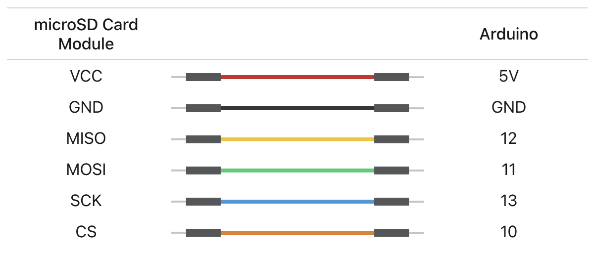

# Lab 4: Creating a Standalone Arduino

## Contents

- [Lab 4: Creating a Standalone Arduino](#lab-4-creating-a-standalone-arduino)
  - [Contents](#contents)
  - [Materials](#materials)
  - [Introduction](#introduction)
    - [Arduino Power Requirements](#arduino-power-requirements)
    - [Data Logging](#data-logging)
  - [Procedure](#procedure)
    - [1. Powering the Arduino](#1-powering-the-arduino)
    - [2. Measuring Battery Voltage](#2-measuring-battery-voltage)
    - [3. Adding the TMP36](#3-adding-the-tmp36)
    - [4. Adding the MicroSD Card Adapter Module](#4-adding-the-microsd-card-adapter-module)
    - [5. Collecting Data](#5-collecting-data)
    - [6. Analyzing the Data in Google Sheets (or Excel)](#6-analyzing-the-data-in-google-sheets-or-excel)
  - [Submission](#submission)

## Materials

- [ ] 1 Arduino Nano
- [ ] 1 Breadboard
- [ ] 1 Programming Cable (and adapters if necessary)
- [ ] 1 TMP36 Temperature Sensor
- [ ] 1 MicroSD Card
- [ ] 1 Data Logger
- [ ] 1 MicroSD Card - USB Adapter
- [ ] 2 1k$$\Omega$$ resistors
- [ ] 12-ish jumper wires
- [ ] 1 9V battery
- [ ] 1 9V battery connector
- [ ] A computer with the Arduino IDE [installed](/tutorials#arduino-ide-install) and [setup](/tutorials#arduino-library).

## Introduction

So far, every time we have used our Arduino to log data, we have read the data through Arduino's Serial monitor, and have powered the Arduino via our computer's USB port. While this has worked so far, our end goal is to launch these Arduinos in rockets! We cannot use a computer for power and data logging for that!

This lab can be broken down into two main sections, one in which we learn to power the board via a battery and estimate the batteries capacity or charge, and one where we record Arduino sensor data onto a microSD card. At the end of this lab, you should have all the knowledge you need to make a fully portable temperature logger.

### Arduino Power Requirements

The Arduino Nanos that we use in this class operate at 5V logic. This means the pins coming off of it, like the digital pins, are all at 5Vs. The Arduino, however, has circuitry inside it that lets it take a range of voltages as input. This is called the Vin pin, and takes a voltage between 7-12V. The Arduino then internally converts that down to a safer 5V level for its own operations. For this lab, we will be powering our Arduino Nano with a 9V battery.

### Data Logging

Our Arduino has some memory on it, but reading and writing to this memory is a rather complicated procedure, which is why we need the Arduino IDE to handle writing the code to the Arduino's memory for us. Writing variables to the Arduino's memory is not user-friendly and is difficult to read back. Therefore, we elect to instead use a microSD card, which has a far higher data capacity and allows us to easily read data on our computer. This lab will use a pre-built data logging module to write data to the microSD card in a similar way you write data out to the Arduino's Serial monitor.

## Procedure

### 1. Powering the Arduino

To start, we want to power our Arduino with the 9V battery. Plug your Arduino into your breadboard, and plug the 9V into it's connection clip. It should only fit on one way, as the 9V's two terminals are different shapes.

Notice that one wire coming out of the battery is red, and one is black. Common practice says that red will be positive, in this case +9V, and the black will be what we connect to our Arduino's GND.

Take these wires and plug them into your Arduino via your breadboard. Red should go to the Arduino's Vin, and black should go to any GND pin.

Once you've plugged the 9V in, the Arduino should light up - even though it isn't plugged into your computer! If it does, congrats, your external power is working! If not, check your connections again.

As one last check that everything is working before we move on, upload the File → Examples → Basics → Blink code that the Arduino IDE comes with to your Arduino. After it finishes uploading, unplug your computer and verify that the onboard LED on the Arduino continues to blink on only the 9V's power.

### 2. Measuring Battery Voltage

Most modern electronics, from your smartphone to even rockets, have some way of reporting back the charge of any internal batteries. While we don't use the battery for very long at any one time in this lab, other people are using the same batteries, and so we do want to verify they are charged.

To measure battery voltage, we can use the analog pins on the Arduino, similar to how we did in lab 1. The caveat of this is, however, that the analog pins can **only take up to 5V!!** So, before reading the battery in, we need to build a voltage divider to step the battery voltage down to 5V max.

Using our voltage divider [(see the resources page for more)](/resources), we can take 2 1k resistors and step 9V down to 4.5V max. Go ahead and build this voltage divider.

When you are done, your 9V battery should have the black wire going to GND, and the red wire going to **both** Vin **and** a voltage divider.

Now, let's test that the voltages look about right. Go to File → Examples → Basics → AnalogReadSerial and change the `analogRead()` function called in `loop()` to be the pin you plugged your voltage divider into. Run this code and make note of the values it returns.

You know on the Arduino Nano this value will be between 0-1024, and that your max voltage, as reported by the Arduino, is 5V. Convert your raw value to the voltage the Arduino read by dividing it by 1023 and multiplying it by 5V. This is the voltage your Arduino recorded.

Your battery, however, has a higher voltage than that. We now need to undo the effects of the voltage divider to determine the batteries original voltage. Since we used the same resistance on either side of the voltage divider, the voltage is being cut in half. Therefore, we can simply multiply the Arduino's recorded voltage by 2 to get the 9V battery's voltage. It should be somewhere between 8 and 10V.

### 3. Adding the TMP36

Just like we did in the last lab, we now need to plug in the TMP36 to an analog pin on the Arduino. Here is the wiring diagram again for your reference:

### 4. Adding the MicroSD Card Adapter Module

Unlike the other sensors and modules we have used so far, the MicroSD module we are using uses the Arduino's digital pins. Luckily for us, there are libraries (that you should have installed when following the tutorial and initially setting up your Arduino IDE), that handle all the complicated digital interfacing for us. All we need to know is which pins to plug the adapter module into.

{: .invert-colors-in-dark-mode }

While your Arduino is powered off and disconnected from the 9V, plug your module in as shown above. The Arduino pins for this **DO** matter and cannot easily be changed, unlike the analog pins.

Once everything is wired up, put your microSD card into the adapter module and plug in your Arduino. At this point you should modify and upload the code found in File → Examples → ENGR100-980 → Lab4-SD.

Please read through the comments of this code file, as in the next lab, you will be adding additional sensors and modifying this file on your own, without it all done for you. In this lab, you may also need to change the analog pins that are the defaults for the TMP36 and voltage divider.

### 5. Collecting Data

With everything plugged into the 9V and running, unplug the Arduino from your computer. Enjoy the portability of your new breadboard and walk around the building a little bit. Try to get your temperature sensor to change, whether it be putting it in a fridge/freezer again, or holding the TMP36 between your fingers.

Go back to the lab and unplug the 9V now. Carefully remove the microSD from the adapter module, and plug it into your computer. You should see a `DATALOG.CSV` file. If you do not, or the file seems corrupted or very small, delete the file, plug the microSD card back in, and watch what the Serial monitor on your computer says while running the code.

Once you have a sufficiently long test (1-2 minutes) and can see that there are clear changes in temperature in the file created, you are done with the hardware portion of this lab!

Before returning all of your equipment, make sure you save your file on your computer!! Maybe even upload it and share it with team members so you have a backup!

Then, delete the .csv file and any other .txt files off of the microSD card (you can leave any folders) so that other teams in future labs have to actually do the lab themselves, and don't just steal your data!

### 6. Analyzing the Data in Google Sheets (or Excel)

Go to a new Google Sheet ([sheets.new](https://sheets.new)) (or Excel file), and go to File → Import → Upload and choose the `DATALOG.CSV` file that your Arduino created.

In the event your Arduino lost power or reset while running, you may have a header at places other than just the top of your spreadsheet. Go through and clean up any of these occurrences and delete their entire row.

Now, let's add some columns to the spreadsheet. Right now you should have Time (ms), TMP36 (Raw), and Voltage (Raw). Let's add "TMP36 (V)", "Voltage (5V)", "TMP36 (C)", and "Voltage (9V)".

In the first cell of each column, you will need to make a simple equation/formula to calculate the values based off of the raw sensor values the Arduino recorded. For example, for turning a raw TMP36 value into a TMP36 voltage, you would write "=(B2/1023)*5" in the TMP36 voltage cell on row 2. Then, click the blue circle in the bottom-right corner of this cell and drag it all the way down. This should now create an auto-calculated TMP36 voltage for each cell.

Repeat this general process for each column, modifying the equations as needed. For converting TMP36 voltages into temperatures, use the same calibration curve you used in the prior lab.

Now, we need to make some graphs to analyze the data. Each graph to make is detailed in its own submission checkbox. Make sure each graph follows tech-comm best-practices and includes a title, axis labels, units, and is clearly visible. For graphs with multiple values over-layed, ensure you have added a legend.

## Submission

On Canvas, you will submit ***ONE PDF*** that will include all of the following:

- [ ] A plot of temperature (C) versus time. Time should be your independent variable.
- [ ] A plot comparing 9V battery voltage to time. Time is again your independent variable.
- [ ] A plot of both 5V reference variables versus time. Both 5V reference variables means both your TMP36's voltage, and your battery's voltage divider voltage (before being scaled up to the voltage pre-voltage divider).
- [ ] A plot of both raw value variables versus time.

To put said content into a PDF, it is suggested you create a new Google Doc ([docs.new](https://docs.new)) and paste your images and write any text in the document. Export/Download this document as a PDF and upload it. **DO NOT SUBMIT A GOOGLE DOC FILE OR SPREADSHEET FILES.**

Submitting anything other than a single PDF may result in your work not being graded or your scores being heavily delayed.

