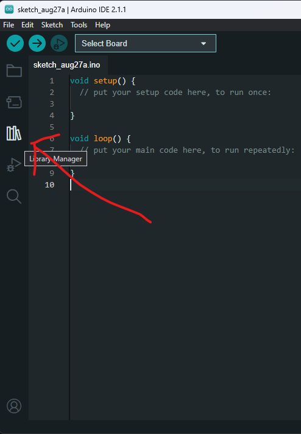
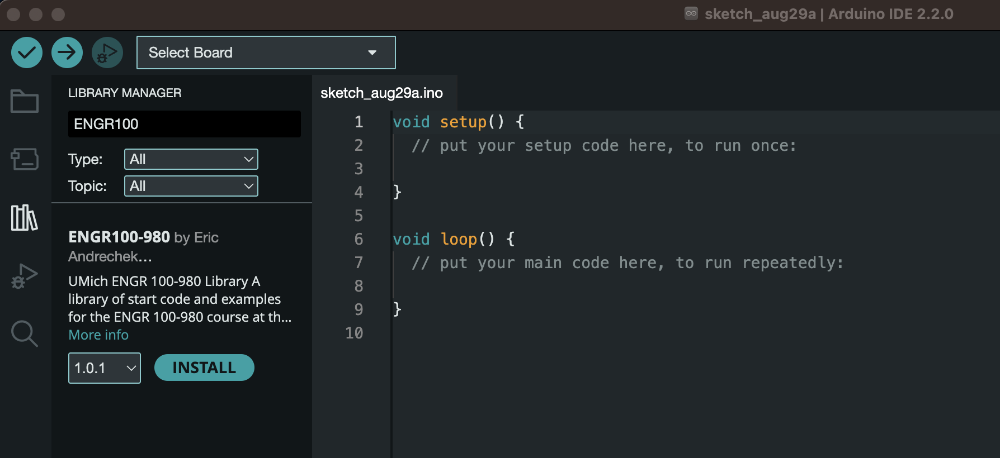
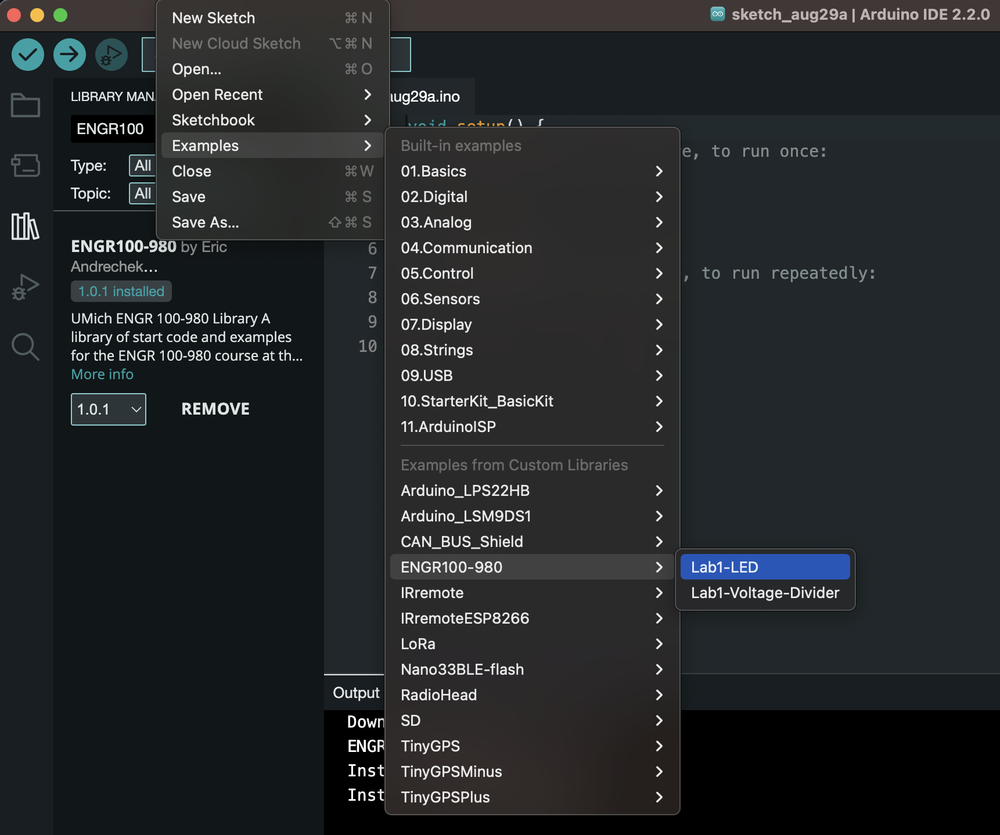
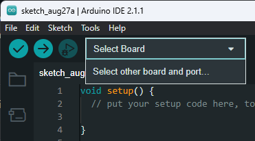
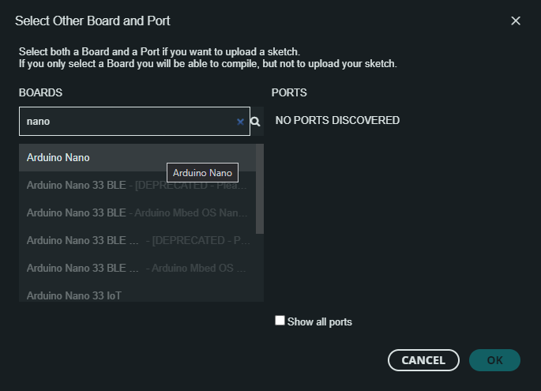

# Tutorials

Walk-throughs on common issues or installations.

## Contents

- [Tutorials](#tutorials)
  - [Contents](#contents)
  - [Arduino IDE Install](#arduino-ide-install)
    - [Windows](#windows)
    - [macOS](#macos)
    - [Linux](#linux)
    - [Chromebook](#chromebook)
  - [Arduino Library](#arduino-library)
  - [Arduino IDE Usage](#arduino-ide-usage)
    - [Using the Starter Code](#using-the-starter-code)
    - [Saving Code](#saving-code)
    - [Connecting to an Arduino](#connecting-to-an-arduino)
    - [Uploading Code](#uploading-code)
    - [Viewing Arduino Output](#viewing-arduino-output)
  - [Altium Student License](#altium-student-license)
  - [Problems with Altium](#problems-with-altium)
  - [Installing VMware](#installing-vmware)

## Arduino IDE Install

### Windows

1. [Download the latest release](https://downloads.arduino.cc/arduino-ide/arduino-ide_latest_Windows_64bit.exe)
2. Follow the instructions in the installation guide.
3. When completing the setup, leave _Run Arduino IDE_ ticked to launch the application, or launch it later from the Start Menu.

### macOS

1. Download the latest release
   - [Intel, 10.14: "Mojave" or newer](https://downloads.arduino.cc/arduino-ide/arduino-ide_latest_macOS_64bit.dmg)
   - [Apple Silicon, 11: "Big Sur" or newer](https://downloads.arduino.cc/arduino-ide/arduino-ide_2.1.1_macOS_arm64.dmg)
2. Double-click the disk image (.dmg) file.
3. Drag and drop the Arduino IDE application into the Applications folder.
4. Launch Arduino IDE the same way you would launch any other application (such as <kbd>Command + Space</kbd> for Spotlight and search for “Arduino”).

### Linux

1. [Download the latest release](https://downloads.arduino.cc/arduino-ide/arduino-ide_latest_Linux_64bit.AppImage)

2. Find the AppImage file in your file manager.

3. Make the AppImage file executable:

   1. Right-click the file.
   2. Choose Properties,
   3. Select the Permissions.
   4. Tick the _Allow executing file as program_ box.

4. Double-click the AppImage file to launch Arduino IDE.

If Arduino IDE fails to open, and you see the text `dlopen(): error loading libfuse.so.2` or `AppImages require FUSE to run`, you may be missing some dependencies. Follow these steps:

1. Open the Terminal application.

2. Enter this command:

   `sudo apt-get -y install libfuse2`

3. Press `Enter` and wait for the process to complete.

4. Close the Terminal window.

5. Try launching Arduino IDE again by double-clicking the AppImage file.

### Chromebook

See [this guide](https://support.arduino.cc/hc/en-us/articles/360016495639-Use-Arduino-with-Chromebook).

*Note: We as instructional staff have **not** tested all of the Arduino labs on a Chromebook, so some features may not work as intended.*

## Arduino Library

After running the Arduino IDE, either click the library manager on the left (looks like some books), or press <kbd>Ctrl+Shift+I</kbd>.

In the bar that says "Filter your search..." type "ENGR100-980" and press <kbd>Enter</kbd>.

Click on the "Install" button on the library. If no errors pop-up, you are good to go!

## Arduino IDE Usage

### Using the Starter Code

For the majority of projects in our class, we will give you sample starter code for each lab. These are packaged in the library you downloaded in the step above. If you have not yet installed this library, [do so now](#arduino-library)!

To access this starter code within the Arduino IDE, go to File>Examples>ENGR 100-980, and click on the desired starter code.

### Saving Code

Whenever you modify anything in this code, you will need to specify where you want it to save on your computer. **Arduino IDE does NOT auto-save your code!**

To save, press <kbd>Ctrl + s</kbd> (or <kbd>Command + s</kbd> for Mac), pick a location, and name it something. It is recommended you make a folder somewhere accessible on your computer for you to save all of your code onto for this class. This will make it easier to find to reference or submit later.

To open your projects again, go to File>Open, or double click on the `.ino` file right from your file manager, which should open it in the Arduino IDE.

### Connecting to an Arduino

To start, we need to tell the Arduino IDE which type of Arduino we are using (in our case, an Arduino Nano Every), and which port it is located at.

To do this, either select the "Select Board" dropdown

and choose the Arduino Nano Every and whatever port shows up when it is plugged into your computer like so:

.

When you plug in an Arduino, it _should_ show up in the list of options for the port regardless of the way you specify the port. If it is not showing up, before asking for help, try:

1. Unplugging and re-plugging the Arduino / USB cables
2. Force quitting the Arduino IDE (after saving your work!) and relaunching it
3. Unplugging all of the wires connecting to pins on your Arduino. If there are shorts or if things are wired incorrectly or on the wrong pins, it can cause your Arduino not to show up.

Once the Arduino port shows up, select it.

### Uploading Code

When you have an Arduino plugged in and ready to go, you will need to verify and upload your code. With no Arduino plugged in, you can test that your code will compile either by pressing the check-mark in the top left of the IDE, or by pressing <kbd>Ctrl + R</kbd>. If this runs successfully you know you are ready to upload to an Arduino!

When your Arduino is plugged in, you don't need to compile/verify, the upload button will do that for you. Simply press the right arrow or <kbd>Ctrl + U</kbd> and watch the progress.

If your code is failing to upload to your Arduino, try the troubleshooting steps listed above, as well as trying to press and hold the reset button on the Arduino for a period of time and continue holding it while plugging it into the computer. Sometimes this can help an Arduino that is stuck executing code forever to take a break to accept your new code.

Additionally, if uploading is failing, try changing to a different bootloader. This is under tools, and you can try switching between the old and new bootloaders.

### Viewing Arduino Output

Arduinos have 2 main ways of interfacing and displaying data on your computer. These are through the Serial Monitor, and the Serial Plotter. Both are accessible via the buttons in the top right-hand corner of the Arduino IDE.

Both of these connections only work when an Arduino is plugged in and the port is specified correctly. Additionally, you will need to confirm that the baud rate - the speed at which the Arduino and your computer agree to exchange data at - is set the same for both your computer and your Arduino. This is configurable from Serial Monitor in the top right hand corner of the console in the bottom of your screen. The default for most instances is 9600 baud.

## Altium Student License

Altium licenses are no longer automatically provided to all students. All University Altium licenses will be tied to individual Altium accounts. The process for getting one of these accounts can take a day or two (business days) so we strongly recommend you set up your Altium account now before you need it to run Altium.

1. Go this page: [https://www.altium.com/education/students](https://www.altium.com/education/students) and click "Enroll for Free."
   - You will eventually need to log in using your university credentials and be required to submit documentation proving you are a student. Submit a picture of your MCard, front and back, for this step.

2. When your application gets approved and activated, you should have an Altium Education account. Unfortunately, this is not the same as the actual Altium software account. The password for the education account will not allow you to run Altium Designer. You should at this point, however, also receive the correct Altium account but this step is often buggy.

3. Assuming you didn't get an email to set up the Altium software account/password, go to this page: [https://auth.altium.com/?ReturnUrl=https://www.altium.com/](https://auth.altium.com/?ReturnUrl=https://www.altium.com/) and either click "forgot password" or utilize the Google log in on the bottom left.

4. With the Altium account you can now log in to Altium Designer to obtain a license. You can also download and install Altium on your own machine if you desire.

5. When you run Altium and the old license doesn't work, you will see a license page. Click sign in and either use the Google G button or the Altium username and password from step 3.

6. Now select the Altium license and click "use" (or right click on the license and choose "use").

7. You should now be licensed in Altium and see something like this.

## Problems with Altium

Some common issues on Altium results from a previous work session not being shut down properly. An error displaying "License Renewal Failed" would show up in the Altium window. To address this issue, please go through the following links/resources.

[https://www.altium.com/documentation/altium-designer/license-management#roaming-an-on-demand-license]( https://www.altium.com/documentation/altium-designer/license-management#roaming-an-on-demand-license)

[https://www.altium.com/documentation/knowledge-base/altium-designer/cannot-use-an-on-demand-license-as-the-seat-is-occupied](https://www.altium.com/documentation/knowledge-base/altium-designer/cannot-use-an-on-demand-license-as-the-seat-is-occupied)

## Installing VMware
The Windows Remote Desktop Service allows eligible individuals at Michigan Engineering to remotely access the CAEN Lab Software Environment (CLSE) for Windows. It is intended to provide the same experience as being in a CAEN computer lab.

1. Follow instructions here to install VMware to your computer. **This software is essential for Mac users to run Altium.**
[https://teamdynamix.umich.edu/TDClient/76/Portal/KB/ArticleDet?ID=5311](https://teamdynamix.umich.edu/TDClient/76/Portal/KB/ArticleDet?ID=5311)

2. To connect VMware to the CAEN server:  
[https://teamdynamix.umich.edu/TDClient/76/Portal/KB/ArticleDet?ID=5309](https://teamdynamix.umich.edu/TDClient/76/Portal/KB/ArticleDet?ID=5309)

